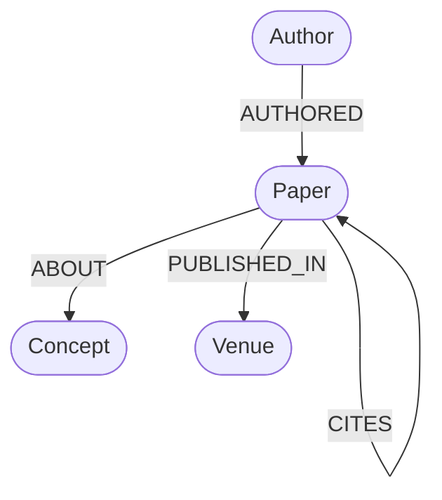
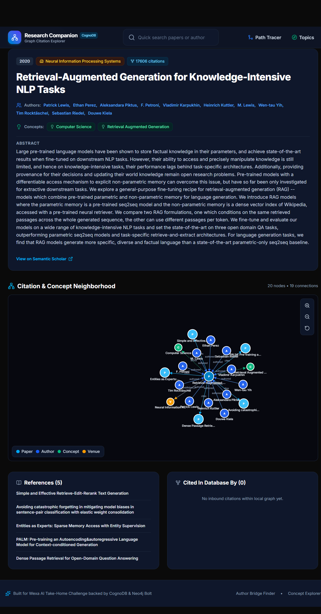
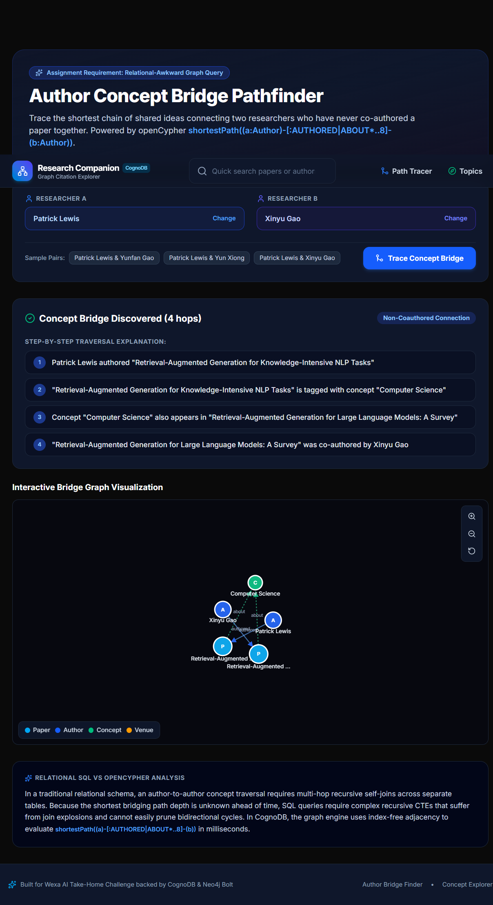
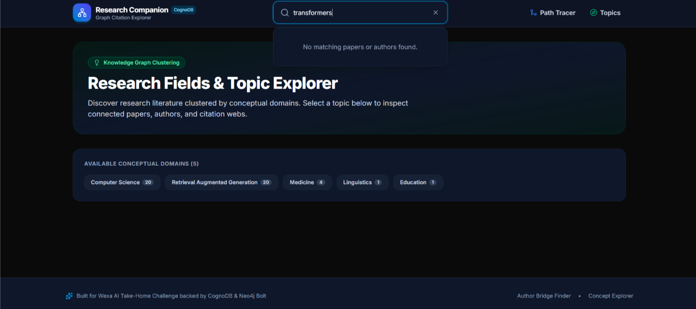
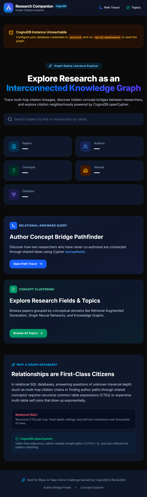

# Research Companion

A graph-native literature discovery web application for exploring academic citation neighborhoods, tracing multi-hop concept lineages, and discovering non-coauthored author bridge paths powered by CognoDB openCypher.

---

## Demo & Links

- **Live Hosted Application**: [Live Demo](https://researcherbuddy-m3gh.onrender.com/)
- **Video Walkthrough**: [Screen Recording](https://www.loom.com/share/c528969dfcc54fff867c4829bca84ef6) 

---

## Use Case

Modern scientific research is an interconnected web of ideas, citations, and collaborations, yet traditional literature tools present search results as flat, disconnected lists. Research Companion enables researchers, PhD students, and engineers to explore papers in their structural graph context. Users can trace multi-hop citation chains filtered by conceptual domain, inspect one-hop citation neighborhoods, and uncover latent concept-bridging paths between researchers in adjacent disciplines who have never directly co-authored.

---

## Why a graph database?

The core questions researchers ask when exploring literature are fundamentally questions of **unknown traversal depth across heterogeneous relationships**:

- *"What citation path of ideas connects these two papers across 3 hops?"*
- *"Which intermediary papers and concepts bridge two researchers who have never worked together?"*
- *"What are the second-degree collaborators and shared conceptual domains of this author?"*

In a relational database (SQL), answering these questions requires complex recursive Common Table Expressions (CTEs) or expensive multi-way self-joins across separate junction tables (`papers`, `authors`, `paper_authors`, `concepts`, `paper_concepts`, `citations`). As the traversal depth increases, SQL queries suffer from join explosions and become unmaintainable.

In CognoDB (openCypher), relationship traversal is a first-class citizen using index-free adjacency. The same multi-hop traversal is expressed as an intuitive, direction-aware pattern match:

```cypher
MATCH path = (start:Paper {id: $startPaperId})-[:CITES*1..3]->(reached:Paper)
WHERE (reached)-[:ABOUT]->(:Concept {name: $conceptFilter})
RETURN path, reached
ORDER BY length(path) ASC
LIMIT $limit
```

Variable-length paths execute in milliseconds without exponential join overhead.

---

## Data Model



### Nodes

- **`Paper`**: `id` (String, unique), `title` (String), `year` (Integer), `abstract` (String), `url` (String), `citationCount` (Integer)
- **`Author`**: `id` (String, unique), `name` (String)
- **`Concept`**: `name` (String, unique)
- **`Venue`**: `name` (String, unique)

### Relationships

- `(:Author)-[:AUTHORED]->(:Paper)` — Links researchers to the papers they have published.
- `(:Paper)-[:CITES]->(:Paper)` — Directed citation edge from a source paper to a referenced paper.
- `(:Paper)-[:ABOUT]->(:Concept)` — Conceptual tagging linking papers to research topics.
- `(:Paper)-[:PUBLISHED_IN]->(:Venue)` — Publication venue classification (journals, conferences).

Uniqueness constraints on `Paper.id`, `Author.id`, `Concept.name`, and `Venue.name` double as indexes, ensuring fast, idempotent `MERGE` operations during ingestion.

---

## Tech Stack

- **Framework**: Next.js 16 (App Router) and React 19
- **Language**: TypeScript (strict mode)
- **Database**: CognoDB (managed openCypher over Bolt) via the official `neo4j-driver`
- **Data Ingestion**: Semantic Scholar Graph API for live scholarly dataset seeding
- **Graph Visualization**: D3.js force simulation with interactive SVG canvas and zoom/pan controls

---

## Setup & Run Instructions

### 1. Provision CognoDB Instance
1. Sign up at [CognoDB Cloud Console](https://console.cognodb.com).
2. Create a free `c0` instance in your preferred region.
3. Copy your `bolt+s://<instance-id>.databases.cognodb.cloud` connection URI and generated password.

### 2. Clone & Install Dependencies
```bash
git clone https://github.com/DanishShah619/researcher.git
cd wexa_ai
npm install
```

### 3. Configure Environment Variables
Copy the template and fill in your CognoDB credentials:
```bash
cp .env.local.example .env.local
```

Edit `.env.local`:
```env
COGNODB_URI="bolt+s://<your-instance-id>.databases.cognodb.cloud"
COGNODB_USER="cognodb"
COGNODB_PASSWORD="<your-password>"
```

### 4. Seed the Graph Database
Run the automated seed script to fetch live papers from the Semantic Scholar API and populate your CognoDB instance:
```bash
npm run seed
```

### 5. Start the Development Server
```bash
npm run dev
```
Open [http://localhost:3000](http://localhost:3000) in your browser.

---

## Main Queries, Explained

### 1. Multi-Hop Citation Traversal
Finds all papers reachable within $N$ citation hops from a starting paper that also touch a specified research concept:

```cypher
MATCH (start:Paper {id: $startPaperId})
MATCH path = (start)-[:CITES*1..3]->(reached:Paper)
WHERE ($conceptFilter IS NULL OR $conceptFilter = '' OR (reached)-[:ABOUT]->(:Concept {name: $conceptFilter}))
WITH path, reached, length(path) AS depth
RETURN reached.id AS id,
       reached.title AS title,
       reached.year AS year,
       depth,
       [node IN nodes(path) | node.id] AS pathPaperIds
ORDER BY depth ASC, reached.citationCount DESC
LIMIT $limit
```

**Why it's interesting**: This query traverses variable-length citation lineages of arbitrary depth. It demonstrates how graph databases natively filter connected subgraphs along path trajectories, allowing researchers to explore how an foundational idea propagates into specific sub-disciplines.

---

### 2. Non-Coauthor Concept Bridge Pathfinder (Relational-Awkward)
Computes the shortest path of shared ideas connecting two researchers who have never co-authored a paper:

```cypher
MATCH (a:Author {id: $authorA}), (b:Author {id: $authorB})
WHERE a <> b AND NOT (a)-[:AUTHORED]->(:Paper)<-[:AUTHORED]-(b)
MATCH path = shortestPath((a)-[:AUTHORED|ABOUT*..8]-(b))
RETURN path,
       length(path) AS pathLength,
       [node IN nodes(path) | {
         id: coalesce(node.id, node.name),
         label: labels(node)[0],
         title: node.title,
         name: node.name,
         year: node.year
       }] AS nodesData,
       [rel IN relationships(path) | {
         type: type(rel),
         source: coalesce(startNode(rel).id, startNode(rel).name),
         target: coalesce(endNode(rel).id, endNode(rel).name)
       }] AS relsData
```

**Why it's interesting**: This query traverses heterogeneous node labels (`Author`, `Paper`, `Concept`) and relationship types (`AUTHORED`, `ABOUT`) with an unknown hop depth while enforcing a negative co-authorship constraint. In a relational database, this requires recursive CTEs across 5 tables; in Cypher, it is an expressive shortest-path calculation.

---

## Screenshots of the UI

### Paper Detail Page with Neighborhood Graph
  


### Author Concept Bridge Pathfinder
  


### Empty State
  


### Graceful Error State
  


---

## Project Structure

```text
├── app/
│   ├── apis/
│   │   ├── graph/
│   │   │   ├── path/route.ts            # Author bridge shortestPath query
│   │   │   ├── researchtopics/route.ts  # Concept clustering query
│   │   │   └── stats/route.ts           # Graph statistics query
│   │   ├── researchauthors/
│   │   │   └── [id]/route.ts            # Author profile & co-authors
│   │   └── researchpapers/
│   │       ├── [id]/
│   │       │   ├── citations/route.ts   # Multi-hop citation traversal
│   │       │   └── route.ts             # Paper detail & 1-hop neighborhood
│   │       └── search/route.ts          # Global parameterised search
│   ├── authors/[id]/page.tsx            # Author detail view
│   ├── papers/[id]/page.tsx             # Paper detail view & neighborhood graph
│   ├── path_tracer/page.tsx             # Interactive concept bridge pathfinder
│   ├── researchtopics/page.tsx          # Conceptual domain browser
│   ├── layout.tsx                       # Root layout & navigation
│   └── page.tsx                         # Dashboard & exploration overview
├── components/
│   ├── ui/                              # Reusable component primitives (Badge, Card, StatCard, etc.)
│   ├── GraphView.tsx                    # Client-side D3 interactive force graph
│   └── SearchBar.tsx                    # Autocomplete search component
├── lib/
│   ├── db.ts                            # Driver singleton, session manager, & type converter
│   └── queries.ts                       # Centralized parameterised openCypher queries
└── seed/
    ├── data.ts                          # Topic configuration & hop limits
    ├── semanticScholar.ts               # Rate-limited Semantic Scholar API client
    └── seed.ts                          # Idempotent graph ingestion pipeline
```
